# 개체 관계 다이어그램 (ERD)

애플리케이션의 전체 데이터베이스 스키마입니다. (기본 + 소셜/랭킹/추천 기능 포함)

```mermaid
erDiagram
    USERS ||--|| HEALTH_PROFILES : "1:1 건강정보 (has)"
    USERS ||--o{ MEAL_LOGS : "1:N 식단기록 (records)"
    USERS ||--o{ FRIDGE_ITEMS : "1:N 냉장고 (owns)"
    USERS ||--o{ RATINGS : "1:N 평가 (gives)"
    RECIPES ||--o{ RATINGS : "1:N 평점 (receives)"

    %% 스크랩/장바구니/채팅
    USERS ||--o{ RECIPE_SCRAPS : "1:N 스크랩 (saves)"
    RECIPES ||--o{ RECIPE_SCRAPS : "1:N 스크랩됨 (scrapped)"
    USERS ||--o{ SHOPPING_ITEMS : "1:N 장바구니 (needs)"
    USERS ||--o{ CHAT_SESSIONS : "1:N 채팅방 (chats)"
    CHAT_SESSIONS ||--o{ CHAT_MESSAGES : "1:N 메시지 (contains)"

    %% 소셜/공유/추천 (NEW)
    USERS ||--o{ FRIENDSHIPS : "N:M 친구 (friends)"
    USERS ||--o{ SHARED_RECIPES : "1:N 공유 (shares)"
    RECIPES ||--o{ SHARED_RECIPES : "1:N 공유됨 (shared)"
    RECIPES ||--o{ DAILY_RECIPES : "1:N 오늘의 추천 (featured)"

    USERS {
        Long id PK "사용자 ID"
        String email "이메일"
        String password "비밀번호"
        String name "이름"
        String profile_image "프로필 이미지"
        DateTime created_at "가입일"
    }

    HEALTH_PROFILES {
        Long id PK "프로필 ID"
        Long user_id FK "사용자 ID"
        List allergies "알레르기 (JSON)"
        List chronic_conditions "만성질환 (JSON)"
        List dietary_restrictions "식단제한 (JSON)"
        List medications "복용약물 (JSON)"
        List goals "건강목표 (JSON)"
    }

    MEAL_LOGS {
        Long id PK "기록 ID"
        Long user_id FK "사용자 ID"
        Date record_date "기록 날짜"
        String breakfast "아침 메뉴"
        String lunch "점심 메뉴"
        String dinner "저녁 메뉴"
        List snacks "간식 (JSON)"
    }

    FRIDGE_ITEMS {
        Long id PK "재료 ID"
        Long user_id FK "사용자 ID"
        String name "재료명"
        String quantity "수량"
        String category "카테고리"
        Date expiry_date "유통기한"
    }

    RECIPES {
        Long id PK "레시피 ID"
        String title "요리명"
        String description "설명"
        List ingredients "재료 목록 (JSON)"
        List steps "조리 순서 (JSON)"
        Integer calories "칼로리"
        Integer difficulty "난이도"
        Integer cooking_time "조리 시간"
        Double average_rating "평점"
        Long view_count "조회수 (인기순위용)"
        String image_url "이미지 URL"
    }

    RATINGS {
        Long id PK "평가 ID"
        Long user_id FK "사용자 ID"
        Long recipe_id FK "레시피 ID"
        Integer score "점수"
        String comment "코멘트"
        DateTime created_at "작성일"
    }

    RECIPE_SCRAPS {
        Long id PK "스크랩 ID"
        Long user_id FK "사용자 ID"
        Long recipe_id FK "레시피 ID"
        DateTime created_at "스크랩 일시"
    }

    SHOPPING_ITEMS {
        Long id PK "장바구니 ID"
        Long user_id FK "사용자 ID"
        String name "구매할 재료명"
        String quantity "필요 수량"
        Boolean is_purchased "구매 여부"
    }

    CHAT_SESSIONS {
        Long id PK "세션 ID"
        Long user_id FK "사용자 ID"
        String title "채팅방 제목"
        DateTime created_at "시작 일시"
    }

    CHAT_MESSAGES {
        Long id PK "메시지 ID"
        Long session_id FK "세션 ID"
        String sender "발신자 (USER/AI)"
        String content "메시지 내용"
        DateTime sent_at "발송 일시"
    }

    %% 새로 추가된 테이블
    FRIENDSHIPS {
        Long id PK "친구관계 ID"
        Long requester_id FK "요청자 ID"
        Long receiver_id FK "수신자 ID"
        String status "상태 (ACCEPTED/PENDING)"
        DateTime created_at "맺은 날짜"
    }

    SHARED_RECIPES {
        Long id PK "공유 ID"
        Long sender_id FK "보낸사람 ID"
        Long receiver_id FK "받는사람 ID"
        Long recipe_id FK "레시피 ID"
        String message "함께 보낸 메시지"
        DateTime shared_at "공유 일시"
    }

    DAILY_RECIPES {
        Long id PK "추천 ID"
        Long recipe_id FK "레시피 ID"
        Date target_date "추천 날짜"
        String reason "추천 사유 (AI 코멘트)"
    }
```

## 신규 기능 설명
1.  **친구와 레시피 공유**:
    *   `FRIENDSHIPS`: 사용자 간의 친구 관계를 관리합니다.
    *   `SHARED_RECIPES`: 친구에게 특정 레시피를 메시지와 함께 공유합니다.
2.  **인기 레시피 순위**:
    *   `RECIPES` 테이블에 `view_count`(조회수) 필드를 추가했습니다.
    *   인기 순위는 `view_count`(조회수), `average_rating`(평점), `SCRAPS` 수(스크랩 수)를 종합하여 산출할 수 있습니다.
3.  **오늘의 레시피**:
    *   `DAILY_RECIPES`: 매일 날짜별로 추천 레시피를 지정하여 보여줍니다. (관리자 지정 또는 AI 자동 선정)
